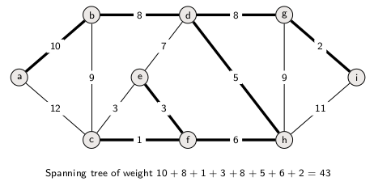
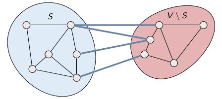
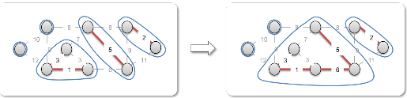
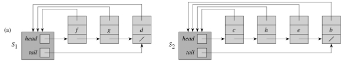
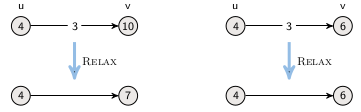

Algorithms

[TOC]

# Defintions

**Algorithm : ** A tool for solving a well-specified computational problem, whose statement specifies in general terms the desired input/output relationship. The algorithm describes a specific computational procedure for achieving that input/output relationship.

**Instance (of a problem) : ** a pair formed of a specific input and its corresponding output.

**Loop invariant : ** A property that remains true before (and after) each iteration of a loop. Often used for proof of correctness in presence of loops. This invariant must verify 3 conditions :

- **Initialization : ** The loop invariant is true prior to the first iteration of the loop.
- **Maintenance : ** If the loop invariant is true before an iteration of the loop, it remains true before the next iteration.
- **Termination : ** When the loop terminates, the invariant, - usually along with the reason that the loop terminated - gives us a useful property that helps show that the alorithm is correct.

# Sorting Algorithms

## Insertion sort

Takes as parameter an array $A[1...n]$ and the length $n$ of the array. The algorithm iterates form the start of the array and compares each elements to the ones before it (like sorting a hand of playing cards).

```c
Insertion-Sort(A,n)
	for j = 2 to n
		key = a[j]
		// Insert A[j] into the sorted sequence A[1...j-1]
		i = j-1
		while i > 0 and A[i] > key
			A[i+1] = A[j]
			i = i-1
		A[i+1] = key
```

**Loop invariant : ** At the start of each iteration of the "outer" *for* loop - the loop indexed by j- the subarray $A[1,...,j-1]$ consists of the elements originally in $A[1,...,j-1]$ but in sorted order.

**Complexity : ** Best case : $O(n)$, worst case : $O(n^2)$, in-place

## Merge Sort

Apply divide & conquer to sorting. Divides the array into 2 smaller ones until the array is of trivial size. Then it sorts the subarrays and merge the results into the final sorted array.

```c
Merge-Sort(A, p, r)
	if p < q
		q = floor((p + q) / 2) // divide
		Merge-Sort(A, p, q) // conquer
		Merge-Sort(A, q+1, r) // conquer
		Merge(A, p, q, r)
```

Place the two subarrays in 2 separate "piles" with the smaller element of each pile on top. Compare the two top elements and place the smallest one in the final sorted array. To avoid checking if a pile is empty, put a "sentinel" element of infinite value in the bottom of each pile.
```c
Merge(A, p, q, r)
	n1 = q - p + 1
	n2 = r-q
	L[1..n1+1], R[1..n2+1] = new Array
	for i = 1 to n1
		L[i] = A[p + i - 1]
	for j = 1 to n2
		R[j] = A[q + j]
	L[n1 + 1] = infty
	R[n2 + 1] = infty
	i = 1
	j = 1
	for k = p to r
		if L[i] <= R[j]
			A[k] = L[i]
			i = i + 1
		else
			A[k] = R[j]
			j = j + 1
```

**Complexity : ** $O(n\log n)$ (best and worst case)

## Heapsort

- Builds a max-heap from the array
- Starting with the root (the maximum element), the algorithm places the maximum element into the correct place in the array by swapping it with the element in the last position in the array
- "Discard" this last node (knowing that it is in its correct place) by decreasing the heap size, and calling `Max-Heapify` on the new (possibly incorrectly-placed) root
- Repeat this "discarding" process until only one node (the smallest element) remains, and therefore is in the correct place in the array

```c
Heapsort(A, n)
	Build-Max-Heap(A, n)
	for i = n downto 2
		exchange A[1] with A[i]
		Max-Heapify(A, 1, i-1)
```
**Complexity : ** $O(n\log n)$, in-place

## Topological sort

**Input : ** A directed acyclic graph (DAG) $G = (V, E)$

**Output : ** a linear ordering of vertices such that if $(u, v)\in E$, then $u$ appears somewhere before $v$

```c
Topological-Sort(G)
	1. Call DFS(G) to compute finishing time v.f for all v ∊ G.V
	2. Output vertices in order of decreasing finishing times
```
**Running time : ** $Theta(V + E)$ (same as DFS)

# Solving recurrences

## Substitution method

- Guess the form of the solution
- Use mathematical induction to find the constants and show that the solution works

## Recursion trees

- Each node corresponds to the cost of a subproblem
- We sum the costs within each level of the tree to obtain a set of per-level costs
- Then we sum all the per-level cosrs to determine the total cost of all levels of the recursion

$T(n) = T(n/3) + T(2n/3) + cn$
$T(1) = c$

```
^	        	  cn ---------------> cn
|	         	 /   \
|	        	/     \
log2(n)	       /       \  
|	     	cn/3      c2n/3 --------> cn
|	     	 /  \      / \
|	    	/    \    /   \
v	 	cn/9  c2n/9 c2n/9 c4n/9 ----> cn
                    

```

## Master method

Let $a \geq 1$ and $b \geq 1$ be constants, let $T(n)$ be defined on the nonnegative integers by the recurrence :

$$T(n) = aT(n/b) + f(n)$$

Then $T(n)$ has the following asymptotic bounds :

- if $f(n) = O(n^{\log_b a-\epsilon})$ for some constant $\epsilon > 0$, then $T(n)=\Theta(n^{\log_b a})$
- if $f(n) = \Theta(n^{\log_b a})$, then $T(n) = \Theta(n^{\log_b a}\log n)$
- if $f(n) = \Omega(n^{\log_b a + \epsilon})$ for some constant $\epsilon > 0$, and if $a\cdot f(n/b) \leq c \cdot f(n)$ for some constant $c < 1$ and all sufficiently large $n$, then $T(n) = \Theta(f(n))$

# Maximum-subarray problem

## Definition

**Input: ** An array $A[1...n]$ of numbers
**Output: ** Indices $i$ and $j$ such that $A[i...j]$ has the greatest sum of any nonempty, contiguous subarray of $A$, along with the sum of the values in $A[i...j]$

## Divide-and-Conquer approach

**Divide** the subarray into two subarrays of as equal size as possible. Find the midpoint *mid* of the subarrays, and consider the subarrays $A[low...mid]$ and $A[mid + 1...high]$.

**Conquer** by finding maximum subarrays of $A[low..mid]$ and $A[mid + 1...high]$.

**Combine** by finding a maximum subarray that crosses the midpoint, and using the best solution out og the three.

*Any subarray must either lie entirely on one side of the midpoint or cross the midpoint.*

```c
Find-Maximum-Subarray(A, low, high)
	if high == low
		return (low, high, A[low]) // base case : only one element 
	else 
		mid = ⌊(low + high)/2⌋ 
		(left-low, left-high, left-sum) = Find-Maximum-Subarray(A, low, mid)
		(right-low, right-high, right-sum) = Find-Maximum-Subarray(A, mid + 1, high)
		(cross-low, cross-high, cross-sum) = Find-Max-Crossing-Subarray(A, low, mid, high)
	if left-sum ≥ right-sum and left-sum ≥ cross-sum
		return (left-low, left-high, left-sum)
	elseif right-sum ≥ left-sum and right-sum ≥ cross sum
		return (right-low, right-high, right-sum)
	else 
		return (cross-low, cross-high, cross-sum)
```

_**Divide**_ takes constant time: $\Theta(1)$
_**Conquer**_ recursively solves two subproblems, each of size $n/2 \Rightarrow T(n/2)$
_**Merge**_ time dominated by `Find-Max-Crossing-Subarray` $\Rightarrow \Theta(n)$

Recursion for running time is :

$T(n) = \begin{cases}
\Theta(1) & \text{if } n = 1 \\
2T(n/2) + \Theta(n) & \text{otherwise}
\end{cases} \Longrightarrow T(n) = \Theta(n\log n)$ 

### Finding maximum subarray crossing midpoint

- Any subarray crossing the midpoint $A[mid]$ is made of two subarrays $A[i . . . mid]$ and $A[mid + 1, . . . , j]$ where $low \leq i \leq mid$ and $mid < j \leq high$.
- Find maximum subarrays of the form $A[i . . . mid]$ and
$A[mid + 1 . . . j]$ and then combine them.

```c
Find-Max-Crossing-Subarray(A, low, mid, high)
	// Find a maximum subarray of the form A[i...mid]
	left-sum = -∞
	sum = 0
	for i = mid downto low
		sum  = sum + A[i]
		if sum > left-sum
			left-sum = sum
			max-left = i
	// Find a maximum subarray of the form A[mid+1...j]
	right-sum  = -∞
	sum = 0
	for j = mid + 1 to high
		sum = sum + A[j]
		if sum > right-sum
			right-sum = sum
			max-right = j
	// Return the indices and the sum of the two subarrays
	return (max-left, max-right, left-sum + right-sum)
```
**Complexity : ** $\Theta(n)$ (space and time)

# Matrix Multiplication

## Definition

**Input : ** Two $n \times n$ (square) matrices, $A = (a_{ij})$ and $B = (b_{ij})$
**Output : ** $n \times n$ matrix $C = (c_{ij})$, where $C = A \cdot B$

## Strassen's Algorithm

Idea: make less recursive calls

- Perform only 7 recursive multiplications of $n/2 \times n/2$ matrices, rather than 8
- Will cost several additions of $n/2 \times n/2$ matrices, but just a constant more

$\Longrightarrow$ can still absorb the constant factor for matrix additions into the $\Theta(n^2)$ term

**Divide** each of $A$, $B$, $C$ into four $n/2 \times n/2$ matrices :

$\begin{pmatrix}
C_{11} & C_{12} \\
C_{21} & C_{22}
\end{pmatrix} = \begin{pmatrix}
A_{11} & A_{12} \\
A_{21} & A_{22}\end{pmatrix} \cdot \begin{pmatrix}
B_{11} & B_{12} \\
B_{21} & B_{22}\end{pmatrix}$

**Conquer : ** Calculate recursively 7 matrix multiplications, each of two $n/2 \times n/2$ matrices : 

$M_1 := (A_{11} + A_{22})(B_{11} + B_{22})$
$M_2 := (A_{21} + A_{22})B_{11}$
$M_3 := A_{11}(B_{12} - B_{22})$
$M_4 := A_{22}(B_{21} - B_{11})$
$M_5 := (A_{11} + A_{12})B_{22}$
$M_6 := (A_{21} - A_{11})(B_{11} + B_{12})$
$M_7 := (A_{12} - A_{22})(B_{21} + B_{22})$

**Combine : **Let

$C_{11} = M_1 + M_4 - M_5 + M_7$
$C_{12} = M_3 + M_5$
$C_{21} = M_2 + M_4$
$C_{22} = M_1 - M_2 + M_3 + M_6$

- Dividing takes time $\Theta(n^2)$
- Conquering makes 7 recursive calls, each multiplying $n/2 \times n/2$ matrices $\Rightarrow 7T(n/2)$
- Combining takes time $\Theta(n^2)$ time to add $n/2 \times n/2$ matrices

$T(n) = \begin{cases}
\Theta(1) & \text{if } n = 1 \\
7T(n/2) + \Theta(n^2) & \text{if } n > 1
\end{cases} \Longrightarrow T(n) = \Theta(n^{\log_2 7})$

## Maximum-flow problem

### The Ford-Fulkerson method

**Basic idea : **

- As long as there is a path from source to sink, with available capacity on all edges in the path
- Send flow along one of these paths and then we find another path and so on

```c
Ford-Fulkerson-Method(G, s, t)
	Initialize flow f to 0
	while exists an augmenting path p in the residual network G_f
		augment flow f along p
	return f
```
augmenting path = simple path from $s$ to $t$

#### Residual network

Given a flow $f$ and a network $G=(V, E)$, the residual network consists of edges with capacities that represent how we can change the flow on those edges.

**Residual capacity : **

$c_f(u, v) = \begin{cases}
c(u, v) - f(u, v)& \text{if } (u, v) \in E \\
f(v, u) & \text{if } (v, u) \in E \\
0 & \text{otherwise}
\end{cases}$

**Residual network : **

$G_f = (V, E_f)$ where $E_f = \{(u, v) \in V \times V: c_f(u, v) > 0\}$


#### Running time

If capacities are irrational then the Ford-Fulkerson method might not terminate. If we take the *shortest path* or the *fattest path* then this will not happen if the capacities are integers.

Augmenting path | Number of iterations
--- | ---
BFS shortest path | $\leq \frac{1}{2} E \cdot V$
Fattest path | $\leq E \cdot \log(E\cdot U)$

- $U$ is the maximum flow value
- *Fattest path:* choose augmenting path with largest minimum capacity (bottleneck)

# Data structures

## Heaps

- Nearly complete binary tree
- Max-heap property : key of $i$'s children is smaller or equal to $i$'s key (*min*-heap : greater or equal)
- Height of node = # of edges on a longest simple path from the node down to a leaf
- Height of heap = height of root = $\Theta(\log n)$

Use that tree is almost complete to store it in an array

$A = \begin{array}{|c|c|c|c|c|c|c|c|c|c|}
\hline
16 & 14 & 10 & 8 & 7 & 9 & 3 & 2 & 4 & 1 \\
\hline
\end{array}$

- $\text{Root}$ is `A[1]`
- $\text{Left(i)}$ is `2i`
- $\text{Right(i)}$ is `2i + 1`
- $\text{Left(i)}$ is `⌊i/2⌋`

### Max-Heapify

Given an $i$ such that the subtrees of $i$ are heaps, it ensures that the subtree rooted at $i$ is a heap that satisfies the heap property. 

- Compare $A[i]$, $A[\text{Left(i)}], A[\text{Right(i)}]$
- If necessary, swap $A[i]$ with the largest of the two children to preserve heap property
- Continue this process of comparing and swapping down the heap, until subtree rooted at $i$ is max(or min)-heap.

```c
Max-Heapify(A, i, n)
	l = Left(i)
	r = Right(i)
	if l ≤ n and A[l] > A[i]
		largest = l
	else largest  = i
	if r ≤ n and A[r] > A[largest]
		largest  = r
	if largest ≠ i
		exchange A[i] with A[largest]
		Max-Heapify(A, largest, n)
```
**Complexity : ***running time :* $\Theta(\text{height of i}) = \Theta(\log n)$, *space :* $\Theta(n)$

### Build-Max-Heap

Given unordered array $A$ of length $n$, `Build-Max-Heap` outputs a heap.

```c
Build-Max-Heap(A, n)
	for i = ⌊n/2⌋ downto 1
		Max-Heapify(A, i, n)
```
**Complexity : ** $O(n)$ calls to `Max-Heapify`, each of which takes $O(n\log n)$ time $\Rightarrow O(n\log n)$ in total
**Tighter analysis : ** runtime of `Max-Heapify` is linear in the height of the node it’s run on : $\sum_{h = 0}^{\log n}\{ \text{\# nodes of height h} \}O(h) = O\left (n\sum_{h = 0}^{\log n} \frac{h}{2^h} \right ) = O(n)$ since $\sum_{h = 0}^{\infty}\frac{h}{2^h} = \frac{1/2}{(1-1/2)^2} = 2$

## Priority queues

- Maintains a dynamic set S of elements
- Each element has a *key* - an associated value that regulates its importance

4 operations : 

- $\text{Insert(S, x)}$: inserts element $x$ inton $S$
- $\text{Maximum(S)}$: returns element of $S$ with largest key
- $\text{Extract-Max(S)}$: removes and returns element of $S$ with largest key
- $\text{Increase-Key(S, x, k)}$: increases value of element $x$'s key to $k$; assume $k \geq x$'s current key value

Heaps efficiently implement priority queues.

### Heap-Maximum

Simply return the root in time $\Theta(1)$

```c
Heap-Maximum(A)
	return A[1]
```
**Running time : ** $\Theta(1)$

### Heap-Extract-Max

- Make sure heap is not empty
- Make a copy of the maximum element (the root)
- Make the last node in the tree the new root
- Re-heapify the heap, with one fewer node

```c
Heap-Extract-Max(A, n)
	if n < 1
		error "heap underflow"
	max = A[1]
	A[1] = A[n]
	n = n-1
	Max-Heapify(A, 1, n)
	return max
```
**Runnin time : ** $O(\log n)$ (same as Max-Heapify + constant time assignments)

### Heap-Increase-Key

Given a heap $A$, index $i$, and new value $key$ : 

- Make sure $key \geq A[i]$
- Update $A[i]$'s value to $key$
- Traverse the tree upward comparing new keys to the parent and swapping keys if necessary, until the new key is smaller than the parent's key

```c
Heap-Increase-Key(A, i, key)
	if key < A[i]
		error "new key is smaller than current key"
	A[i] = key
	while i > 1 and A[Parent(i)] < A[i]
		exchange A[i] with A[Parent(i)]
		i = Parent(i)
```
**Running time : ** $O(\log n)$

### Max-Heap-Increase

Given a new $key$ to insert into heap :

- Increment the heap size
- Insert a new node in the last position in the heap, with key $-\infty$
- Increase the $-\infty$ value to $key$ using `Heap-Increase-Key`

```c
Max-Heap-Insert(A, key, n)
	n = n + 1
	A[n] = -∞
	Heap-Increase-Key(A, n, key)
```
**Running time : ** $O(\log n)$ (same as Heap-Increase-Key + constant time assignments)

## Stacks

Last-in, first-out.


- $\text{Push(S, x)}$: insert operation
- $\text{Pop(S)}$: delete operation

Implementation using arrays: $S$ consists of elements $S[1,...,S.top]$

- $S[1]$ element at the bottom
- $S[S.top]$ element at the top

### Stack-Empty

Returns true if the stack is empty.

```c
Stack-Empty(S)
	if S.top = 0
		return true
	else
		return false
```
**Running time : ** $O(1)$

### Push

Pushes an element $x$ on the stack $S$.

```c
Push(S, x)
	S.top = S.top + 1
	S[S.top] = x
```
**Running time : ** $O(1)$

### Pop

Pops the stack.

```c
Pop(S)
	if Stack-Empty(S)
		error "underflow"
	else
		S.top = S.top - 1
		return S[S.top + 1]
```
**Running time : ** $O(1)$

## Queues

First-in, first-out.

- $\text{Enqueue(Q, x)}$: insert operation
- $\text{Dequeue(Q)}$: delete operation


Implementation using arrays: $Q$ consists of elements $S[Q.head, ..., Q.tail-1]$

- $Q.head$ points at the first element
- $Q.tail$ points at the next location where a newly arrived element will be placed

### Enqueue

Enqueue the element $x$ to the tail of queue $Q$.

```c
Enqueue(Q, x)
	Q[Q.tail] = x
		if Q.tail = Q.length
			Q.tail = 1
		else
			Q.tail = Q.tail + 1
```
**Running time : ** $O(1)$

### Dequeue

Dequeue the first element from the queue $Q$.

```c
Dequeue(Q)
	x = Q[Q.head]
	if Q.head = Q.length
		Q.head = 1
	else
		Q.head = Q.head + 1
	return x
```
**Running time : ** $O(1)$s

## Linked lists

- Objects are arranged in linear order
- Not indexes in array, but pointers in each object
- Can be single linked or double linked
- Can be sorted

Search | Insertion | Deletion
--- | --- | ---
$O(n)$ | $O(1)$ | $O(1)$


### Searching

Given $k$, return pointer to first element with key $k$. If no element was found, returns *nil*.

```c
List-Search(L, k)
	x = L.head
	while x ≠ nil and x.key ≠ k
		x = x.next
	return x
```
**Running time : ** $O(n)$

### Inserting

Insert a new element $x$.

```c
List-Insert(L, x)
	x.next = L.head
	if L.head ≠ nil
		L.head.prev = x
	L.head = x
	x.prev = nil
```
With sentinel:
```c
List-Insert'(L, x)
	x.next = L.nil.next
	L.nil.next.prev = x
	L.nil.next = x
	x.prev = L.nil
```
**Running time : ** $O(1)$

### Deleting

Given a pointer to and element $x$, remove it from $L$.

```c
List-Delete(L, x)
	if x.prev ≠ nil
		x.prev.next = x.next
	else 
		L.head = x.next
	if x.next ≠ nil
		x.next.prev = x.prev
```
With sentinel:
```c
List-Delete'(L, x)
	x.prev.next = x.next
	x.next.prev = x.prev
```
**Running time : ** $O(1)$

## Binary Search Trees

**Key property : **

- if *y* is in the left subtree of *x* then *y.key* < *x.key*
- if *y* is in the right subtree of *x* then *y.key > x.key*

Searching | Minimum | Maximum | Successor | Predecessor | Insertion | Deletion
--- | --- | --- | --- | --- | --- | ---
$O(h)$ | $O(h)$ | $O(h)$ | $O(h)$ | $O(h)$ | $O(h)$ | $O(h)$

where *h* is the height of the tree

### Searching

Given the BST rooted at *x* and key *k*, find node containing *k*.

```c
Tree-Search(x, k)
	if x == nil or k == x.key
		return x
	if k < x.key
		return Tree-Search(x.left, k)
	else
		return Tree-Search(x.right, k)
```
**Running time : ** $O(h)$ where *h* is the height of the tree

### Minimum and Maximum

By key property :

- Minimum is located at leftmost node
- Maximum is located at rightmost node

Given BST rooted at *x*, return it minimum.
```c
Tree-Minimum(x)
	while x.left ≠ nil
		x = x.left
	return x
```
**Running time : ** $O(h)$ where *h* is the height of the tree

Given BST rooted at *x*, return its maximum
```c
Tree-Maximum(x)
	while x.right ≠ nil
		x = x.right
	return x
```
**Running time : ** $O(h)$ where *h* is the height of the tree

### Successor and Predecessor

The successor of a node *x* is the node *y* with the smallest key such that *y.key > x.key*. In other words, it is the leftmost node in the right subtree of *x* (if the right subtree is nonempty).

**Case 1 : ** *x* has a non-empty right subtree $\Longrightarrow$*x*'s successor is the minimum in the right subtree
**Case 2 : ** *x* has an empty right subtree $\Longrightarrow$ as long as we're going up to the left we're visiting smaller keys. *x*'s successor *y* is the node that *x* is the predecessor of (*x* is the maximum in *y*'s left subtree).

```c
Tree-Successor(x)
	if x.right ≠ nil
		return Tree-Minimum(x.right)
	y = x.p
	while y ≠ nil and x == y.right
		x = y
		y = y.p
	return y	
```
**Running time : ** $O(h)$ where *h* is the height of the tree

Predecessor is symmetric.

### Printing

#### Printing inorder

- Print left subtree recursively
- Print root
- Print right subtree recursively

```c
Inorder-Tree-Walk(x)
	if x ≠ nil
		Inorder-Tree-Walk(x.left)
		print x.key
		Inorder-Tree-Walk(x.right)
```
**Running time : ** $\Theta(n)$

#### Printing preorder

- Print root
- Print left subtree recursively
- Print right subtree recursively

```c
Preorder-Tree-Walk(x)
	if x ≠ nil
		print x.key
		Preorder-Tree-Walk(x.left)
		Preorder-Tree-Walk(x.right)
```
**Running time : ** $\Theta(n)$

#### Printing postorder

- Print left subtree
- Print right subtree
- Print root

```c
Postorder-Tree-Walk(x)
	if x ≠ nil
		Postorder-Tree-Walk(x.left)
		Postorder-Tree-Walk(x.right)
		print x.key
```
**Running time : ** $\Theta(n)$

### Insertion

- Search for *z.key*
- When arrived at *nil* insert *z* at that position

```c
Tree-Insert(T, z)
	// "search" phase
	y = nil
	x = T.root
	while x ≠ nil
		y = x
		if z.key < x.key
			x = x.left
		else
			x = x.right
	z.p = y
	// "insert" phase
	if y == nil
		T.root = z // Tree T was empty
	else if z.key < y.key
		y.left = z
	else
		y.right = z
```
**Complexity : ** $O(h)$

### Deletion

3 cases :

- if *z* has no children, remove it
- if *z* has one child, then make that child take *z*'s position in the tree
- if *z* has two children, then find its successor *y* and replace *z* by *y*

`Transplant(T, u, v)` replaces subtree rooted at *u* with the one rooted at *v*.

```c
Tranplant(T, u, v)
	if u.p  == nil
		T.root = v
	else if u == u.p.left
		u.p.left = v
	else
		u.p.right = v
	if v ≠ nil
		v.p = u.p
```

Given BST *T* and node *z*, remove *z* from *T*.

```c
Tree-Delete(T, z)
	if z.left == nil
		Transplant(T, z, z.right)        // z has no left child
	else if z.right == nil
		Transplant(T, z, z.left)         // z has just a left child
	else                                             // z has two children
		y = Tree-Minimum(z.right)        // y is z's successor
		if y.p ≠ z                       // y lies within z's right subtree but is not the root of this subtree
			Transplant(T, y, y.right) 
			y.right = z.right
			y.right.p = y
		Transplant(T, z, y)              // replace z by y
		y.left = z.left
		y.left = y
```
**Running time : ** $O(h)$

## Graphs

A graph $G = (E, V)$ consists of :

- a vertex set $V$
- an edge set $E$ that contain (ordered) pairs of vertices

A graph can be directed, undirected, vertex-weighted, edge-weighted, etc.

### Representation

**Adjacency lists**

- Array *Adj* of $|V|$ lists, one per vertex
- Vertex *u*'s list has all vertices *v* such that $(u, v)\in E$ (works for both directed and undirected graphs)
- In pseudocode, *Adj* is denoted as $G.Adj$, so *u*'s list is denoted by $G.Adj[u]$


**Adjacency matrix**

A $|V| \times |V|$ matrix $A = (a_{ij})$ where 

$a_{ij} = \begin{cases}
1 & \text{if }(i, j)\in E \\
0 & \text{otherwise}
\end{cases}$


<span></span> | Adjacency list | Adjacency matrix
----- | --- | ---
**Space** | $\Theta(V + E)$ | $\Theta(V^2)$ 
**Time** to list all vertices adjacent to $u$ | $\Theta(\text{degree}(u))$ | $\Theta(v)$
**Time** to determine wether $(u, v)\in E$ | $O(\text{degree}(u))$ | $\Theta(1)$

We can extend both representation to include other attributes such as edge weights.

### Breath-first search

**Input : ** Graph $G = (V, E)$, either directed or undirected and source vertex $s\in V$

**Output : ** $v.d =$ distance (smallest number of edges) from $s$ to $v$, for all $v\in V$ 

**Idea : **

- Send a wave out from $s$
- First hit all vertices 1 edge away from $s$
- From there, hit all vertices 2 edges away from $s$...

```c
BFS(V, E, s)
	for each u ∊ V\{s}
		u.d = ∞
	s.d = 0
	Q = ∅
	Enqueue(Q, s)
	while Q ≠ ∅
		u = Dequeue(Q)
		for each v ∊ G.Adj[u]
			if v.d == ∞
				v.d = u.d + 1
				Enqueue(Q, v)
```
**Running time : ** $O(V+E)$

- $O(V)$ because every vertex is enqueued at most once
- $O(E)$ because every vertex is dequeued at most once and we examine $(u, v)$ only when $u$ is dequeued. Therefore, every edge examined at most if directed and at most twice if undirected

**Correctness : ** (informal)

- Suppose that $v.d$ is greater than the shortest distance from $s$ to $v$
- but since algorithm repeatedly considers the vertices closes to the root (by adding them to the queue) this cannot happen

**Notes : **

- BFS may not reach all the vertices
- We can save the shortest path tree by keepin track of the ede that discovered the vertex

### Depth-first search

**Input : **Graph $G = (V, E)$, either directed or undirected

**Output : ** 2 timestamps on each vertex: $v.d = $ discovery time and $v.f = $ finishing time

**Idea : **

- Methodically explore every edge
- Start over from different vertices as neccessary
- As soon as we discover a vertex explore from it
	- Unlike BFS, which explores vertices that are close to a source first

As DFS progresses, every vertex has a color:

- WHITE = undiscovered
-  GRAY = discovered, but not finished (not done exploring from it)
- BLACK = finished (have found everything reachable from it)

```c
DFS-Visit(G, u)
	time = time + 1
	u.d = time
	u.color = GRAY            // discover u
	for each v ∊ G.Adj[u]     // explore (u, v)
		if v.color == WHITE
			DFS-Visit(v)
	u.color = BLACK
	time = time + 1
	u.f = time                 // finish u
```

```c
DFS(G)
	for each u ∊ G.V
		u.color = WHITE
	time = 0
	for each u ∊ G.V
		if u.color == WHITE
			DFS-Visit(G, u)
```
**Running time : ** $\Theta(V + E)$

- $\Theta(V)$ because each vertex is discovered once
- $\Theta(E)$ because each edge is examined once of directed graph and twice if undirected graph

DFS forms a *depth-first forest* comprised of > 1 *depth-first trees*. Each tree is made of edges $(u, v)$ such that $u$ is gray and $v$ is white when $(u, v)$ is explored.

**Classification of edges**

*Tree edge:* In the depth-first forest, found by exploring $(u, v)$
*Back edge:* $(u, v)$ where $u$ is a descendant of $v$
*Forward edge:* $(u, v)$ where $v$ is a descendant of $u$, but not a tree edge
*Cross edge:* any other edge

 

**Parenthesis theorem**

For all *u, v*, exactly one of the following holds:

1. *u.d < u.f < v.d < v.f* or *v.d < v.f < u.d < u.f* and neither of *u* and *v* are descendant of each other.
2. *u.d < v.d < v.f < u.f* and *v* is a descendant of *u*.
3. *v.d < u.d < u.f < v.f* and *u* is a descendant of *v*.

**White-path theorem**

Vertex *v* is a descendant of *u* if and only if at time *u.d* there is a path from *u* to *v* consisting of only white vertices (except for *u*, which was just colored gray)

**Acyclic graphs**

A directed graph $G$ is acyclic if and only if a DFS of $G$ yields no back edges.

**Proof:**

1. Back edge $\Rightarrow$ cycle

	Suppose there is a back edge *(u, v)*. Then *v* is an ancestor of *u* in the depth first forest. Therefore there is a path from *v* to *u*, which creates a cycle.

2. Cycle $\Rightarrow$ back edge
	Let *v* be the first vertex discovered in the cycle *C* and let *(u, v)* be the preceding edge in *C*. At time *v.d* vertices in *C* form a white-path from *v* to *u* and hence *u* is a descendant of *v*.

### Strongly Connected Components

**Definition : ** A strongly connected component (SCC) of a directed graph $G = (V, E)$ is a *maximal* set of vertices $C \subseteq V$ such that for all $u, v \in C$, both $u \rightsquigarrow v$ and $v \rightsquigarrow u$.


**Component graph**

For a digraph $G = (V, E)$, its component graph $G^{SCC} = (V^{SCC}, E^{SCC})$ is defined by: 

- $V^{SCC}$ has a vertex for each SCC in $G$
- $E^{SCC}$ has an edge if there's an edge between the corresponding SCC's in $G$

 

$G^{SCC}$ is a Directed Acyclic Graph (DAG).

**Magic Algorithm**

Graph $G^T$ is the transpose of $G$:

- $G^T = (V, E^T), E^T = \{ (u, v) : (v, u) \in E \}$
- $G^T$ is $G$ with all edges reversed

```c
SCC(G)
	1. Call DFS(G) to compute finishing times u.f for all u
	2. Compute G^T
	3. Call DFS(G^T) but in the main loop, consider vertices in order of decreasing u.f (as computed in first DFS)
	4. Output the vertices in each tree of the depth-first forest formed in second DFS as a separate SCC
```
**Running time : ** $\Theta(V+E)$ (each step takes $\Theta(V + E)$

- The first DFS orders SCC's in topological order
- Second DFS then outputs the vertices in each SCC

### Minimum spanning tree (MST)

**Input : ** an undirected graph $G=(V, E)$ with weight $w(u,v)$ for each edge $(u, v)\in E$

**Output : ** a spanning tree of minimum total height

{ width=50% height=50%}

#### Cuts

- A *cut* $(S, V\backslash S)$ is a partition of the vertices into two non empty disjoint sets $S$ and $V\backslash S$
- A *crossing edge* is an edge connecting vertex $S$ to a vertex in $V\backslash S$ 

{width=50% height=50%}

Cut property: consider a cut $(S, V\backslash S)$ and let
- $T$ be a tree on $S$ which is part of a MST
- $e$ be a crossing edge of minimum weight

Then there is a MST of *G* containing *e* and *T*

#### Prim's algorithm

Start with any vertex *v*, set tree *T* to singleton *v*

**Greedily grow tree *T* :**

at each step add to *T* a minimum weight crossing edge with respect to the cut induced by *T*

**Implementation**

- For every node *w*, keep value *dist(w)* that measures the "distance" of *w* from current tree
- When a new node *u* is added to tree, check wether neighbors of *u* decreases theirs distance to tree; if so, decrease distance
- Maintain a min-priority queue for the nodes and their distances

```c
Prim(G, w, r)
    Q ≠ ∅
    for each u in G.V
        u.key = ∞
        u.flag = NIL
        Insert(Q, u)
    Decrease-Key(Q, r, 0)  // r.key = 0
    while Q ≠ ∅
        u = Extract-Min(Q)
        for each v in G.Adj[u]
            if v is in Q and w(u, v) < v.key
                v.flag = u
                Decrease-Key(Q, v, w(U, v))
```

**Running time : ** $O(E\log V)$ *can be made $O(V\log V)$ with careful implementation*

- Initialize *Q* and first for loop: $O(V\log V)$
- Decrease key of *r*: $O(\log V)$
- while loop: *V* `Extract-Min` calls $\Rightarrow O(V\log V)\leq$ E `Decrease-Key` calls $\Rightarrow O(E\log V)$

#### Kruskal's algorithm

Start from empty forest *T*

**Greedily maintain forest *T* which will become MST at the end: ** at each step add cheapest edge that does not create a cycle

**Implementation**

In each iteration, we need to check whether cheapest edge creates a cycle.

This is the same thing as checking whether its endpoints belong to the same component $\Rightarrow$ **use disjoint sets (union-find) data structure**

Let the connected components denote sets

- Initially each singleton is a set
- When edge *(u, v)* is added to *T*, make union of the two connected components/sets

{width=50% height=50%}

```c
Kruskal(G, w)
    A = ∅
    for each vertex v in G.V
        Make-Set(v)
    sort the edges of G.E into increasing order by weight w
    for each (u, v) taken from the sorted list
        if Find-Set(u) ≠ Find-Set(v)
            A = A ∪ {(u, v)}
            Union(u, v)
    return A
```
- Initialize *A*: $O(1)$
- First for loop: *V* `Make-Set`s
- Sort *E*
- Second for loop: $O(E)$ `Find-Set`s and `Union`s
- Total time: $O((V + E)\alpha (V)) + O(E\log E) = O(E\log E) = O(E \log V)$

If edges are already sorted time is $O(E\alpha (V))$ which is almost linear

## Flow networks

- Directed graph $G = (V, E)$
- Each edge $(u, v)$ has a capacity $c(u, v) \geq 0$
- Source $s$ and sink $t$ (flow goes from $s$ to $t$)
- No antiparallel edge (assumed w.l.o.g. for simplicity)

**Flow (definition)**

A flow is a function $f: V \times V \to \mathbb{R}$ satisfying:

- *Capacity constraint:* for all $u, v \in V : 0 \leq f(u, v) \leq c(u, v)$
- *Flow conservation:* for all $u \in V \backslash \{s, t\}, \sum_{v\in V}f(v, u) = \sum_{v\in V}f(u, v)$

**Value of a flow**

$|f| = \sum_{v\in V}f(s, v) - \sum_{v\in V}f(v, s) = \text{flow out of source - flow into source}$

### Min-cuts

A cut of flow network $G(V, E)$ is a partition of $V$ into $S$ and $T = V \backslash S$ such that $s\in S$ and $t\in T$.

**Net flow across a cut**

The net flow across cut $(S, T)$ is:

$f(S, T) = \sum_{u\in S, v\in T}f(u, v) - \sum_{u\in S, v\in T}f(v, u) = \text{flow leaving S - flow entering S}$

**Capacity of a cut**

The capacity of cut $(S, T)$ is:

$c(S, T) = \sum_{u\in S, v\in T}c(u, v)$

**Flow is at most capacity of a cut**

For any flow $f$ and any cut $(S, T)$:

$|f| = f(S, T) \leq \sum_{u\in S, v\in T}c(u, v)$

**Max-flow min-cut theorem**

Let $G = (V, E)$ be a flow network with source $s$ and sink $z$ and capacities $c$ and a flow $f$. The following are equivalent :

1. $f$ is a maximum flow
2. $G_f$ has no augmenting path
3. $|f| = c(S, T)$ for a minimum cut $(S, T)$

For any cut $(S, T), |f| = f(S, T)$

## Disjoint sets

- Also known as "union find"
- Maintain collection $S = \{S_1,...,S_k\}$ of disjoint dynamic (changing over time) sets
- Each set is identified by a *representative*, which is some member of the set

*Doesn't matter which member is the representative, as long as if we aks for the representative twice without modifying the set, we get the same answer both times*

**Operations : **

- `Make-Set(x)`: make a new set $S_i=\{x\}$, and add $S_i$ to $S$ 
- `Union(x, y)`: if $x\in S_yx, y \in S_y$, then $S = S - S_x - S_y\cup \{S_x\cup S_y\}$
	- Representative of new set is any member in $S_x\cup S_y$, often the representative of one of $S_x$ and $S_y$
	- Destroys $S_x$ and $S_y$ (since sets must be disjoint)
- `Find(x)`: return representative of set containing $x$ 

### Connected components

```c
Connected-Components(G)
    for each vertex v in G.V
        Make-Set(v)
    for each edge (u, v) in G.E
        if Find-Set(u) != Find-Set(v)
            Union(u, v)

```
**Running time : **

- $V$ elements
- $\leq V + 3E$ operations on Union-Find data structure
- Total running time if implemented as linked list with weighted-union heuristic : $O(V\log V + E)$
- Total running time if implemented as forest with union-by-rank and path-compression : $O((V + E)\alpha(V))\approx O(V + E)$ 


### Linked list representation

- Each set is a single linked list represented by a set object that has
    - a pointer to the *head* of the list (assumed to be the representative)
    - a pointer to the *tail* of the list
- Each object in the list has attributes for the *set member*, *pointer to the set object* and *next*



**Make-Set and Find**

`Make-Set(x)`: Create a singleton list in time $\Theta(1)$

`Find(x)`: follow the pointer back to the list object, and then follow the *head* pointer to the representative (time $\Theta(1)$)

**Union**

Several ways of doing it :

1. Append *y*'s list onto the end of *x*'s list. Use *x*'s tail pointer to find the end.
    - Need to update the pointer back to the set object for every node on *y*'s list.
    - If appending a large list onto a small list, it can take a while
2. **Weighted-union heuristic** Always append the smaller list to the larger list (break ties arbtrarily)

**Theorem : ** With weighted-union heuristic, a sequence of *m* operations on *n* elements take $O(m + n\log n)$ time.

### Forest of trees

- One tree per set. Root is representative
- Each node only points to its parent

`Make-Set(x)`: Make a single-node tree

```c
Make-Set(x)
    x.p = x
    x.rank = 0
```

`Find(x)`: follow pointers to the root

```c
Find-Set(x)
    if x ≠ x.p
        x.p = Find-Set(x.p)
    return x.p
```

`Union(x, y)`: make one root a child of another

```c
Union(x, y)
    Link(Find-Set(x), Find-Set(y))
```

```c
Link(x, y)
    if x.rank > y.rank
        y.p = x
    else x.p = y
        if x.rank == y.rank
            y.rank = y.rank + 1
```
**Running time : ** $O(m\cdot \alpha(n))$ where $\alpha(n)$ is an extremely slowly growing function.

- $\alpha(n)\leq 5$ for any practical purpose
- The bound $O(m\cdot \alpha(n)$ is tight
**Union by rank**: make the root of the smaller tree a child of the root of the larger tree
- Don't actually use size
- Use rank, which is an upper bound on height of node
- Make the root with the smaller rank a child of the root with the larger rank

**Path Compression: Find path = ** nodes visited during `Find` on the trip to the root, make all nodes on the find path direct children to root 

# Dynamic Programming

**Main idea ** : 

- Remember calculations already made
- Saves enormous amounts of computation

Two diferent ways :

**Top-down with memoization : **

- Solve recursively but store each result in a table
- Memoizing is remembering what we have previously computed

**Bottom-up : **

- Sort the subproblems and solve smaller ones first
- That way, when solving a subproblem, have already solved the smaller subproblems we need

**Optimal substrucure : ** show that a solution to a problem consists of *making a choice*, which leaves one or several subproblems to solve and the optimal solution solves the subproblems optimally. An optimal solution can be built by combining optimal solutions for sub-problems. It implies that the solution can be given by a recursive formula.

**Reconstructing the solution : ** In addition to the solution of each sub-problem, we need to store the choice that corresponds to that solution so we can reconstruct it later.

## Rod cutting

How to cut a rod to maximize the profit ?

**Input : ** A length *n* and table of prices $p_i$, for $i = 1,...n$

**Output : ** The maximum revenue obtainable for rods whose lengths sum up to *n*, computed as the sum of the prices for the individual rods.

**Choice : ** where to make the leftmost cut

**Optimal substructure : ** to obtain an optimal solution, we need to cut the remaining pieces in an optimal way. 

Hence, if we let $r(n)$ be the optimal revenue from a rod of length $n$, we can express $r(n)$ recursively as follows : 

$r(n) = \begin{cases}
0 & \text{if } n = 0 \\
\max_{1 \leq i \leq n}\{p_i + r(n-i)\} & \text{otherwise if } n \geq 1
\end{cases}$

### Top-down with memoization

- Keep the recursive structure of the pseudocde
- Memoize (store) the result of every recursive call
- At each recursive call, try to avoid work using memoized results

```c
Memoized-Cut-Rod-Aux(p, n, r)
	if r[n] ≥ 0
		return r[n]
	if n == 0
		q = 0
	else
		q = -∞
		for i = 1 to n
			q = max(q, p[i] + Memoized-Cut-Rod-Aux(p, n-i, r))
	r[n] = q
	return q
```

```c
Memoized-Cut-Rod(p, n)
	let r[0...n] be a new array
	for i = 0 to n
		r[i] = -∞
	return Memoized-Cut-Rod-Aux(p, n, r)
```
**Time complexity : ** $O(n^2)$

### Bottom-up

- Sort the sub-problems by size
- Solve the smaller ones first
- When reaching a sub-problem, the smaller ones are already solved

```c
Bottom-Up-Cut-Rod(p, n)
	let r[0...1] be a new array
	r[0] = 0
	for j = 1 to n
		q = -∞
		for i = 1 to j
			q = max(q, p[i] + r[j-i])
		r[j] = q
	return r[n]
```

## Matrix chain multiplication

**Input : ** A chain $\langle A_1, A_2, ..., A_n\rangle$ of $n$ matrices, where for $i = 1, 2, .., n$, matrix $A_i$ has dimensions $p_{i-1}\times p_i$.

**Output : ** A full parenthesisation of the product $A_1A_2...A_n$ in a way that minimizes the number of scalar multiplications.

**Choice : ** where to make the outermost parenthesis $(A_1 ... A_k)(A_{k+1} ... A_n)$.

### Optimal substructure

_**if : **_

- the outermost parenthesization in an optimal solution is: $(A_1 A_2 ... A_i)(A_{i+1} A_{i+2} .. A_n)$
- $P_L$ and $P_R$ are optimal parenthesisations for $A_1 A_2 ... A_i$ and $A_{i+1} A_{1+2} ... A_n$ respectively

_**then**_, $((P_L)\cdot (P_R))$ is an optimal parenthesisation for $A_1 A_2 ... A_n$.

**Proof : **

- Let $((O_L)\cdot (O_R))$ be an optimal parenthesisation, where $O_L$ and $O_R$ are parenthesisations for $A_1 A_2 ... A_i$ and $A_{i+1} A_{i+2} ... A_n$ respectively.
- Let $M(P)$ be the number of scalar multiplications required by a parenthesisation.

$M((O_L) \cdot (O_R)) = p_0\cdot p_i \cdot p_n + M(O_L) + M(O_R) \geq p_0 \cdot p_i \cdot p_n + M(P_L) + M(P_R) = M((P_L)\cdot (P_R))$

Since $P_L$ and $P_R$ are optimal : $M(P_L) \leq M(O_L)$ and $M(P_R) \leq M(O_R)$

### Recursive formula

Let $m[i, j]$ be the optimal number of scalar multiplications for calculating $A_i A_{i+1} ... A_j$.

$m[i, j]$ can be expressed recursively as follows:

$m[i, j] = \begin{cases}
0 & \text{if } i = j \\
\min_{i \leq k < j}\{ m[i, k] + m[k+1, j] + p_{i-1}p_kp_j\} & \text{if } i < j
\end{cases}$

Each $m[i, j]$ depend only on subproblems with smaller $j-i$.

Solve recurrence using top-down with memoization or bottom-up which yields an algorithm that runs in time $\Theta(n^3)$ .

## Longest common subsequence

**Input : ** 2 sequences, $X = \langle x_1, .., x_m\rangle$ and $Y = \langle y_1, ..., y_n \rangle$

**Output : ** A subsequence common to both whose length is longest. A subsequence doesn’t have to be consecutive, but it has to be in order.

**Choice : ** Start at the end of both words and move to the left ste-by-step. If the same, pick letter to be in the subsequence. If not the same, optimal subsequence can be obtained by moving a step to the left in one of the words.

### Optimal substructure

Let $X_i$ and $Y_j$ denote the prefixes $\langle x_1, x_2, ..., x_i \rangle$ and $\langle y_1, y_2, ..., y_j \rangle$.

Let $Z = \langle z_1, z_2, ..., z_k \rangle$ be any LCS of $X_i$ and $Y_j$.

_**If **_ $x_i = y_j$, _**then **_ $z_k = x_i = y_j$ and $Z_{k-1}$ is an LCS of $X_{i-1}$ and $Y_{j-1}$.

**Proof : ** Suppose $z_k \not = x_i = y_j$ but then $Z' = \langle z_1 , ... , z_k , x_i \rangle$ is a common subsequence of $X_i$ and $Y_j$ which contradicts $Z$ being a LCS. 

Similarly, suppose that $Z_{k−1}$ is not a LCS of $X_{i−1}$ and $Y_{j−1}$ but then there exists a common subsequence $W$ of $X_{i−1}$ and $Y_{j−1}$ that has length $\geq k$ which in turn implies that $\langle W , z_k \rangle$ has length $\geq k + 1$ contradicting the optimality of $Z$.

### Recursive formulation

Define $c[i, j] = $ length of LCS of $X_i$ and $Y_j$. We want $c[m, n]$.

$c[i, j] = \begin{cases}
0 & \text{if }i = 0 \text{ or } j = 0 \\
c[i-1, j-1] + 1 & \text{if } i, j > 0 \text{ and } x_i = y_j \\
\max(c[i-1, j], c[i, j-1]) & \text{if } i, j > 0 \text{ and } x_i \not = y_j
\end{cases}$

## Optimal Binary Search Trees

- Given sequence $K = \langle k_1, k_2, ..., k_n \rangle$ of $n$ distinct keys, sorted $(k_1 < k_2 < ... < k_n)$
- Want to build a BST from the keys
- For each $k_i$, the probability that a search is for $k_i$ is given by $p_i$
- Want BST with minimum expected search cost
- Actual cost = # of items examined

For key $k_i, \text{cost} = \text{depth}_T(k_i) + 1$, where  $ \text{depth}_T(k_i) $ denotes the depth of $k_i$ in BST $T$

$$\mathbb{E}(\text{search cost in T}) = \sum_{i=1}^n( \text{depth}_T(k_i) + 1)p_i = 1 + \sum_{i=1}^n \text{depth}_T(k_i)p_i $$

- Optimal BST might not have smallest height
- Optimal BST might not have highest-probabilty key at root

DP programming to the rescue !

**Optimal substructure : ** A binary search tree can be built by first picking the root and then building the subtrees recursively. After picking root solution to subtrees must be optimal.

**Recursive formulation : ** Let $e[i, j] = $ expected search cost of optimal BST of $k_i...k_j$ : 

$e[i, j] = \begin{cases}
0 & \text{if } i = j+1 \\
\min_{i \leq r \leq j}\{e[i, r-1] + e[r + 1, j] + \sum_{l = i}^j p_l \}
\end{cases}$

Solve with top-down with memoization or bottom-up, total running time is $\Theta(n^3)$.

# The shortest path problem

**Problem variants: **

- **Single-source: ** Find shortes paths from *source* vertex to every vertex
- **Single-destination: ** Find shortest paths to given *destination* vertex (can be solved by single-source by reversing edge directions)
- **Single-pair: ** Find shortest path from *u* to *v* (no algorithm known that is better in worst case than solving single-source)
- **All-pairs: ** Find shortes path from *u* to *v* for all pairs *(u, v)* of vertices (can be solved by solving single-source for each vertex. Better algorithm known) 

## Bellman-Ford algorithm

- Can be used to find negative cycles
    - Run for *n*-iterations and detect cycles in "shortest path tree" these will correspond to negative cycles
- Easy to implement in distributes settings: each vertex repeatedly ask their neighbors for the best path
    - Good for routing and dynamic networks

**Input: ** directed graph with edge weights, a source *s*, no negative cycles

For each vertex *v* keep track of 

- $l(v)$: the current *upper estimate* of length of shortest path to *v*
- $\pi(v)$: the predecessor of *v* in this shortest path

**Start** by trivial initialization:

```c
Init-Single-Source(G, s)
    for each v in G.V
        v.d = ∞
        v.pi = NIL
    s.d = 0
```

Can we improve the shortest path estimate for *v* by going through *u* and taking $(u, v)$?

```c
Relax(u, v, w)
    if v.d > u.d + w(u, v)
        v.d = u.d + w(u, v)
        v.pi = u
```

{width=50% height=50%}

Bellman-Ford updates shortesr path estimates iteratively by using `Relax`.

```c
Bellman-Ford(G, w, s)
    Init-Single-Source(G, s)
    for i = 1 to |G.V| - 1
        for each esge (u, v) in G.E
            Relax(u, v, w)
```
**Running time : ** $\Theta(E\cdot V)$

- `Init-Single-Source` updates $l, \pi$ for each vertex in time $\Theta(V)$
- Nested for loops run `Relax` $V - 1$ times for each edge. Hence total time for these loops is $\Theta(E\cdot V)$
- Final for loop runs once for each edge. Time is $\Theta(E)$

Only garanteed to work if no negative cycles!

### Detecting negative cycles

There is a negative cycle reachable from the source if and only if the $l$-value of at least one node changes if we run one more (n:th) iteration of Bellman-Ford.

```c
Bellman-Ford(G, w, s)
    Init-Single-Source(G, w, s)
    for i = 1 to |G.V| - 1
        for each edge (u, v) in G.E
            Relax(u, v, w)
    for each edge (u, v) in G.E
        if v.d > u.d + w(u, v)
            return false
    return true
```

## Dijkstra's algorithm

Only works when all weights are positive
- Greedy and faster than Bellman-For
- Similar idea to Prim's algorithm (essentially weighted version of BFS)
-
Start with source $S = \{s\}$

**Greedily grow $S$ : ** at each step add to S the vertex that is closest to $S$ (minimum $v\in S : u.d + w(u, v))$

**Implementation** with priority-queue as Prim's algorithm with shortest path keys :

```c
Dijkstra(G, w, s)
    Init-Single-Source(G, s)
    S = ∅
    Q = G.V    // insert all vertices into Q
    while Q ≠ ∅
        u = Extract-Min(Q)
        S = S ∪ {u}
        for each vertex v in G.Adj[u]
            Relax(u, v, w)
```
**Running time : ** Like Prim's dominated by operations on priority queue:

- If binary heap, each operation takes $O(\log V)$ time $\Rightarrow O(E\log V)$
- More careful implementation time is $O(V\log V + E)$

